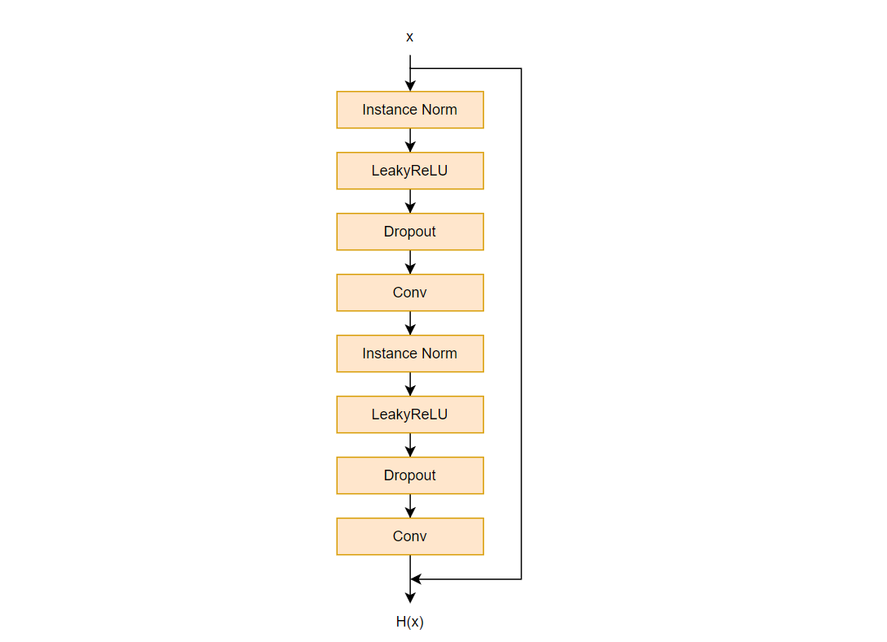
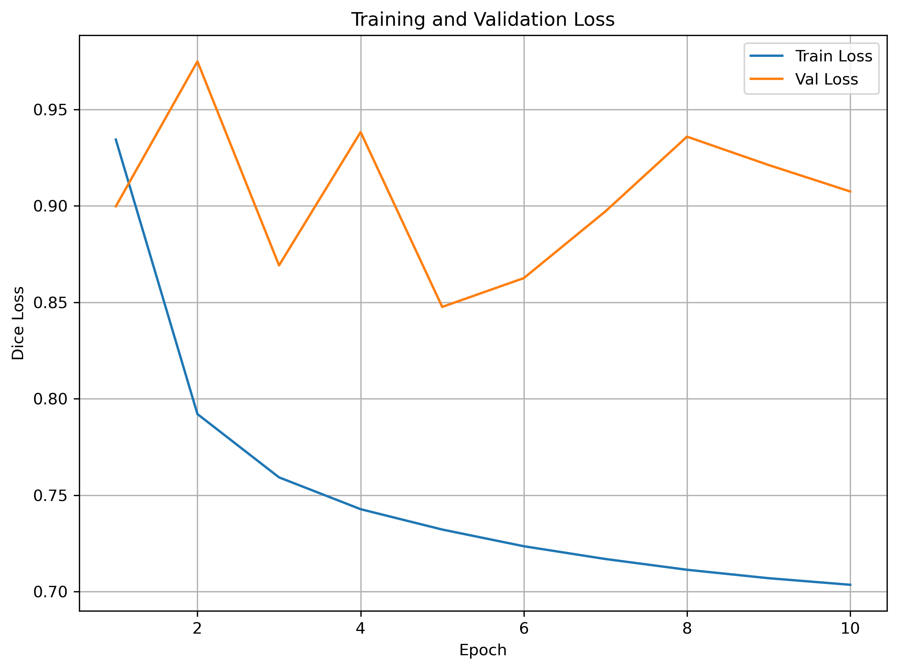
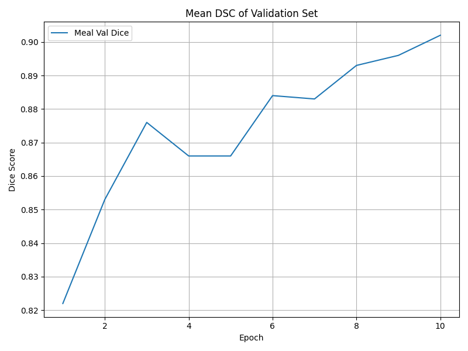
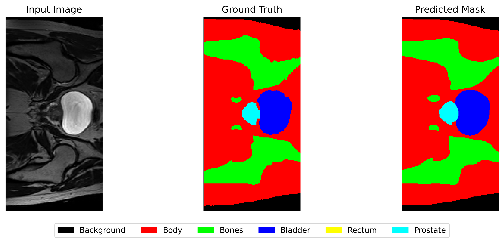
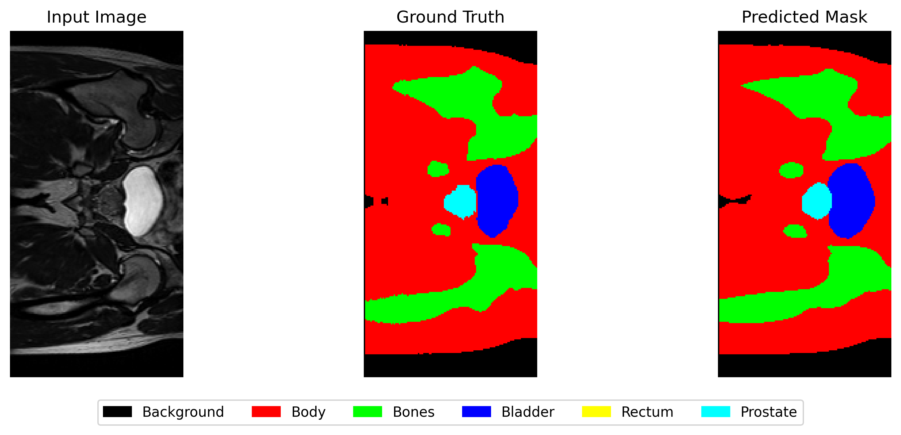
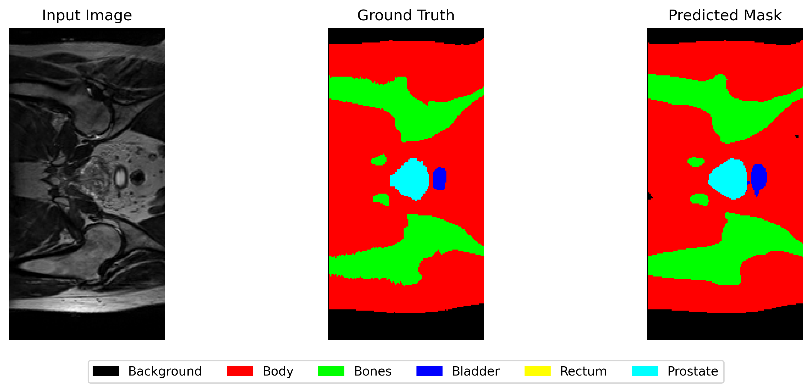

# HipMRI 2D Improved UNet Prostate Segmentation
Task: 1.3.3 - Normal

## Project Overview
This project involved processing 2D slices of MRI images of the hip. Images were in Nifti format, with segmentation available for 6 different classes. Segmentation classes included:
- Background (0)
- Body (1)
- Bones (2)
- Bladder (3)
- Rectum (4)
- Prostate (5)

The goal of this project was to segment hip MRI images to identify the prostate with with a minimum accuracy of 0.75 measured with Dice Similarity Coefficient. 

### The Problem
Medical image segmentation allows identification of specific regions of interest within an image, which can be used for downstream tasks like disease dagnosis. Manual segmentation of specific regions requires expertise of the anatomical region being identified. This can often be time consuming and can be oftentimes very challenging, requiring specialist knowledge. As noise can be introduced during the imaging process, manual segmentation can be variable and subjective between observers. To address these challenges, and improve region identification speed, automated methods using deep learning can be used. This improves consistency, reduce identification time, and improve medical wokflow to support clinical decision making.

## Installation
### Dependencies
A python installation is required to run the model generation and validation code. Python `3.13.5` was used during training on Rangpur. The code has been tested on python `3.11.2`, so a it is suggested an installation of `3.11.2` or higher is used. PyTorch was the chosen machine learning library for training.

Project dependencies can be installed from `requirements.txt` using the command `  pip install -r requirements.txt`. The following libraries should be installed:

```
matplotlib==3.10.7
nibabel==5.3.2
numpy==2.3.4
torch==2.9.0+cu126
torchvision==0.24.0+cu126
tqdm==4.67.1
```

### Running the Model
`train.py` can be run to generate a model from the training set.

To evaluate the model against the test set, run `predict.py`. When the `predict.py` is run, coloured predicted segmentations will be generated for each slice and stored in `./predictions/`

Model checkpoints are configured to save to the `./checkpoints/unet_checkpoints/` folder for every 5th epoch. The final model output is saved to the base diretor of the project as `unet_prostate.pth`.

A logging system was also implemented to save console outputs while the model is running. These are stored within `./checkpoints/logs/` and is generated for each epoch that is run (until `MAX_EPOCHS` specified in `train.py` or until the predefined Dice Score is met). Datapoints which are logged include:
- Training loss
- Training Dice Scores for each class
- Valuation loss
- Valuation Dice Scores for each class
- Mean Dice Score
- Learning Rate

### Expected Resources
To run the training script, you'll need the HipMRI dataset. `train.py` has been set up to expect the following folder structure for the images:
- `keras_slices_data/keras_slices_seg_test`
- `keras_slices_data/keras_slices_seg_train`
- `keras_slices_data/keras_slices_seg_validate`
- `keras_slices_data/keras_slices_test`
- `keras_slices_data/keras_slices_train`
- `keras_slices_data/keras_slices_validate`

Images can be downloaded from [CSIRO](https://doi.org/10.25919/45t8-p065). For the training, validation, and test dataset splilt, please see the dataset and data loading section below.

### Project Structure
- `train.py` - contains the training loop script
- `predict.py` - contains the testing loop script
- `modules.py` - contains the building blocks for the model
- `utils.py` - contains helper functions used by other files

## Model Architecture
An improved UNet architecture was used for segmentation. It follows a similar structure to the original UNet which includes a contracting path, skip connections, bottleneck, and an expanding path. However, key improvements were added, including:
- **Pre-activation Residual Blocks** which have the following structure
    - InstanceNorm
    - LeakyReLU
    - Conv
    - Dropout
    - InstanceNorm
    - LeakyReLU
    - Conv
    - Dropout
- **InstanceNorm2D** for per image normalisation to improve training with small batch sizes
- **Deep Supervision** to improve gradient flow and convergence through more training stability
- **Dropout layers** to reduce overfitting of data and improve generalisation. This has been preset to 0.2.



The UNet consisted of a contracting path, bottleneck, and expanding path with the the following feature structure:
- Contracting path: `64 -> 128 -> 256 -> 512`
- Bottleneck: `1024`
- Expanding: `512 -> 256 -> 128 -> 64`

Model implementation can be found in `modules.py`.

## Dataset and Data Loading
The dataset was acquired from a retrospective MRI-alone radiation therapy study from the Calvary Mater Newcastle Hospital by [Dowling, et al. (2015)](https://doi.org/10.1016/j.ijrobp.2015.08.045).

Splitting of the data was as follows:
- Training: 11,460 slices
- Validation: 660 slices
- Test: 540 slices

Matching segmentation data for each slice of training, validation, and test sets were used. All images were in NIfTI format.

### Data Processing
The raw data from the CSIRO data portal is in 3D NIfTI format. This was preprocessed into 2D slices for each of the cases. Images where then renamed into the following format: 
`case_###_week_#_slice_#.nii.gz`. Segmentation masks were also split into 2D slices, with the following naming convention: `seg_###_week_#_slice_#.nii.gz`. The `#` represent individual digits. 

### Dataset Split
The original dataset was split as follows:
- Training: Case 4 - Case 35 (31/38 cases, note missing case 1-3 and case 34)
- Validation: Case 36 - Case 39 (4/38 cases)
- Test: Case 40 - Case 42 (3/38 Cases)

Across cases, this split allows an approximate 80/10/10 split for unique cases in each set of data. After processing into 2D slices, the split becomes approximately 90/5/5 for training, validation, test. This split follows similar segmentation tasks performed on medical imaging using UNets by [Tran et al, 2024](https://arxiv.org/html/2407.17181v1).

### Data Loading
Custom dataloaders were created to load MRI data. This can be found in `dataset.py`.
Images and segmentation masks were resized to [256 * 128] to ensure consistent image sizes. 
Masks were resized and converted into one-hot format.

## Training
Training was conducted with the following parameters:

| Parameter | Value |
| ----- | :------: |
| MAX_EPOCHS | 100 |
| Batch Size | 8 |
| Initial Learning Rate | 1e-4 |
| Optimizer | Adam |
| Scheduler | Cosine Annealing |
| Loss | Weighted Dice Loss and Weighted Cross Entropy

Weighting was applied to each segmentation class as the inverse of the pixel counts of each class in the masks across the training set. This is calculated each time before the training loop begins. 

Loss was calculated as an even weighting of the dice loss and cross entropy loss for each batch processed during the training loop. The combined weight loss was used to speed up convergence and reduce training time. Dice loss was used to optimize for overlap in segmentation regions while cross-entropy offers per-pixel classification accuracy. Combination of both loss functions has been shown to be more effective for segmentation tasks by [Galdran et al, 2022](https://arxiv.org/abs/2209.06078).

The validation dataset was used to evaluate the performance of the model over time. Individual dice scores was calculated for each class. When all classes reached an accuracy of 0.8, the training loop was terminated early. 

A cosine annealing scheduler was used to adjust the learning rate over time during training. 

There is a predefined `MAX_EPOCHS` of 100, which can be modified in `train.py`.

### Training Epoch
Early termination of the training loop was implemented. When individual dice scores for all segmentation classes reached 0.8, the training was stopped. A buffer of 0.05 was added to the target DSC of 0.75 for the test set.

10 Epochs were completed before the preset target of 0.8 was reached.

### Training Loop Results
The validation and training loss was tracked during the training loop. Training loss reduced over time, while validation loss fluctuated. The results were as follows:



The mean DSC of the validation was also tracked in the training loop. This progressively increased with as more epochs were completed during training.



## Testing
The resulting model output was tested against the test set. The DSC scores calculated for the test set was as follows:

| Category | Dice Score |
| --- | :---: |
| Background | 0.995 |
| Body | 0.979 |
| Bones | 0.922 |
| Bladder | 0.946 |
| Rectum | 0.815 |
| Prostate | 0.844 |

These results show that the model meets the pre-set requirement of reaching a DSC of 0.75 for segmenting the prostate from hip MRI.

### Sample Results
Below are samples of 3 different patients within the test dataset. Each segmentation of the images included the prostate, which is shown in cyan below.

Patient 1:


Patient 2:


Patient 3:


## References
Dowling, J. A., Sun, J., Pichler, P., Rivest-Hénault, D., Ghose, S., Richardson, H., Wratten, C., Martin, J., Arm, J., Best, L., Chandra, S. S., Fripp, J., Menk, F. W., & Greer, P. B. (2015). Automatic Substitute Computed Tomography Generation and Contouring for Magnetic Resonance Imaging (MRI)-Alone External Beam Radiation Therapy From Standard MRI Sequences. International journal of radiation oncology, biology, physics, 93(5), 1144–1153. https://doi.org/10.1016/j.ijrobp.2015.08.045

Galdran, A., Carneiro, G., & Ángel, M. (2022, September 14). On the Optimal Combination of Cross-Entropy and Soft Dice Losses for Lesion Segmentation with Out-of-Distribution Robustness. ArXiv.org. https://arxiv.org/abs/2209.06078

Isensee, F., Kickingereder, P., Wick, W., Bendszus, M., & Maier-Hein, K. H. (2018, February 28). Brain Tumor Segmentation and Radiomics Survival Prediction: Contribution to the BRATS 2017 Challenge. ArXiv.org. https://doi.org/10.48550/arXiv.1802.10508

Tran, D.-P., Nguyen, Q.-A., Pham, V.-T., & Tran, T.-T. (2024, July 24). Trans2Unet: Neural fusion for Nuclei Semantic Segmentation. Arxiv.org. https://arxiv.org/html/2407.17181v1